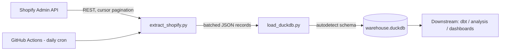

# 🛍️ Shopify → DuckDB Data Pipeline


A self-contained, production-style **ELT pipeline** that extracts e-commerce
product data from the **Shopify Admin REST API**, loads it into a local
**DuckDB** warehouse with automatic schema detection, and runs itself daily
via **GitHub Actions** — no paid connectors, no cloud account, no manual
babysitting.

Built as a hands-on demonstration of API integration, data pipeline
engineering, and CI/CD automation.

---

## 📐 Architecture



**How data flows:**
1. `extract_shopify.py` calls the Shopify Admin REST API, following
   cursor-based pagination and backing off gracefully on rate limits.
2. `load_duckdb.py` batches records and loads them into a local DuckDB
   file, with schema inferred automatically from the JSON.
3. `main.py` orchestrates the run end-to-end, invoked daily by
   `.github/workflows/pipeline.yml`.
4. The resulting `raw_products` table is ready for downstream
   transformation (e.g. dbt) or direct SQL querying.

---

## 🧰 Tech Stack

| Layer            | Tool                                   |
|-------------------|-----------------------------------------|
| Language          | Python 3.11                            |
| Source            | Shopify Admin REST API                 |
| Warehouse         | DuckDB (embedded, file-based)          |
| Orchestration     | Custom Python (`main.py`)              |
| Scheduling / CI-CD| GitHub Actions (daily cron)            |
| Secrets           | GitHub Actions Secrets (nothing committed) |

---

## 📁 Project Structure

```
shopify-bigquery-pipeline/
├── .github/workflows/pipeline.yml   # Scheduled daily sync job
├── src/
│   ├── extract_shopify.py           # Shopify API client + pagination
│   ├── load_duckdb.py               # DuckDB load logic
│   └── main.py                      # Pipeline orchestrator (entry point)
├── requirements.txt
├── .env.example
└── README.md
```

---

## 🚀 Setup

1. **Get a free Shopify development store**
   - Sign up free at [partners.shopify.com](https://partners.shopify.com)
   - Create a "Development store" and enable sample/test data generation

2. **Create a custom app for API access**
   - Store admin → Settings → Apps and sales channels → Develop apps
   - Grant `read_products` (and `read_orders`, `read_customers` if your
     store's plan supports protected customer data — see note below)
   - Install the app, then copy the Admin API access token

3. **Clone and install**
   ```bash
   git clone https://github.com/<your-username>/shopify-duckdb-pipeline.git
   cd shopify-duckdb-pipeline
   pip install -r requirements.txt
   ```

4. **Configure credentials**
   ```bash
   cp .env.example .env
   # fill in SHOPIFY_SHOP and SHOPIFY_ACCESS_TOKEN
   ```

5. **Run it**
   ```bash
   python -m src.main --entities products
   ```
   This creates `warehouse.duckdb` locally. Query it directly:
   ```bash
   python -c "import duckdb; print(duckdb.connect('warehouse.duckdb').execute('SELECT * FROM raw_products LIMIT 5').fetchdf())"
   ```

6. **Automate it on GitHub**
   Add repo secrets (Settings → Secrets and variables → Actions):
   `SHOPIFY_SHOP`, `SHOPIFY_ACCESS_TOKEN`. The included workflow then runs
   daily at 02:00 UTC, or on demand from the Actions tab, committing the
   refreshed `warehouse.duckdb` back to the repo.

---

## 🧠 Design Notes / Talking Points

- **Cursor-based pagination** — Shopify's REST API paginates via `Link`
  response headers rather than page numbers, handled in
  `_paginated_get()`.
- **Rate-limit handling** — retries on HTTP 429 using the `Retry-After`
  header instead of a fixed sleep interval.
- **Schema-on-read** — raw JSON loads via DuckDB's `read_json_auto`, so
  upstream Shopify payload changes don't break the load step; typing and
  transformation are deferred to a downstream layer.
- **Portable warehouse target** — the loader is an isolated module
  (`load_duckdb.py`); swapping to BigQuery/Snowflake/Postgres later means
  writing one new module with the same interface, no orchestration changes.
- **Idempotency** — first batch per run replaces the table, later batches
  append; production would key on `updated_at_min` with a `MERGE`/upsert.

> **Note on scope:** the client supports Orders, Products, and Customers
> (`ShopifyClient.get_orders()`, `get_customers()`, `get_products()`), but
> this repo's live demo runs Products only — Shopify gates order/customer
> PII behind a paid store plan, unavailable on a free development store.
> The extraction and load code paths for all three entities are identical
> and fully implemented.

---

## 🔭 Possible Extensions

- [ ] Add a `dbt` project on top of the raw tables for staging/mart models
- [ ] Incremental loads using `updated_at_min` watermarks instead of full syncs
- [ ] Swap `load_duckdb.py` for a BigQuery/Snowflake loader in a cloud environment
- [ ] Slack/email alerting on pipeline failure
- [ ] Sample analytical SQL queries against the raw tables

---

*Built as a portfolio project demonstrating API integration, data
pipeline design, and CI/CD automation.*
